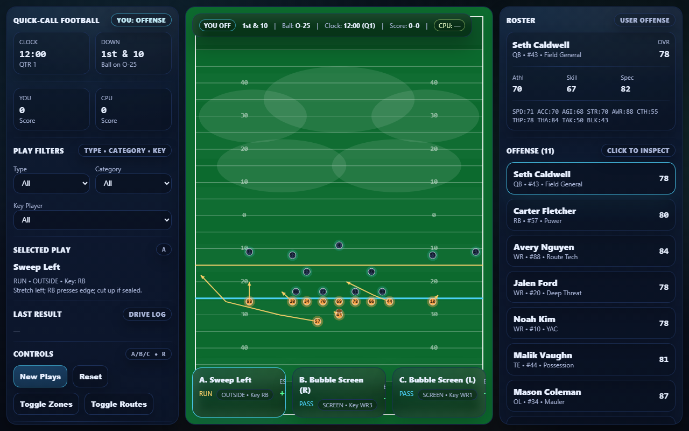

# Quick-Call Football

A browser-based **offensive play-calling / football strategy game** written in HTML/JS
(with companion Python versions). Call plays, read defensive zone coverage, and manage
your roster — a top-down field diagram shows routes, blocks, and zones live.

## Features
- Offensive play filters (Type / Category / Key Player) and hotkey play selection (A/B/C)
- Live field diagram with receiver routes, blocking paths, and defensive zones
- Roster inspect with player ratings (OVR, SPD, ACC, AWR, THP, etc.)
- Game state HUD: down & distance, ball position, clock, score

## Files
| Path | Purpose |
|------|---------|
| `Quickhit 6.1.html` | Latest playable build (HTML/JS) |
| `Quickhit 6.1 Python New.txt`, `Quick 3.txt`, `Quick 3.1.html`, `Quichit4.html`, … | Earlier builds and Python ports |
| `screenshots/playcall.png` | Play-calling screen preview |
